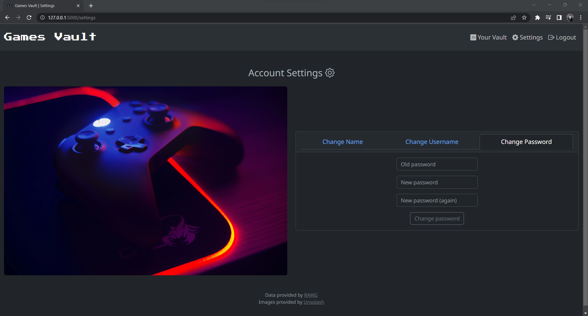

# **Games Vault** - CS50x Final Project
### [**Video Demo**](https://www.youtube.com/watch?v=pljtBWLa3fc)
### **Description:** A game list web application using the RAWG API to get video game data and store your favorite games in a SQLite database

# **Technologies**
- Flask
- Python
- SQLite3
- HTML
- CSS
- Javascript
- Bootstrap

# **Installation**
- Install all the required libraries from [requirements.txt](./requirements.txt)
- Create a free account on [RAWG](https://rawg.io/apidocs) to receive your API Key
- Copy and paste the API Key in the terminal (swap abcde12345 with your API Key)
```
$ export API_KEY=abcde12345
```
- Run the application
```
$ flask run
```

# **Features**

## **Register/Login Page**


You have to create an account to access this app. You have to enter a name, username, and password. **PLEASE DON'T USE A PASSWORD THAT YOU USE ON OTHER WEBSITES.** Once you've created an account, you'll be redirected to the index page.

## **Index Page**

If you're logged in, you'll be redirected to this page. This is where you would search for a game by entering its name. Once you hit search, you'll move to the results page.

## **Results Page**

This page shows you 20 results from the search you entered. If you click on the 'Learn more' button, a modal will pop up.


A modal has popped up with more information about the game, which includes:
- release date
- platforms
- metacritic score
- ESRB rating
- genres
- and where to buy the game

If you click on the 'Add to vault' button, the game will be saved to a database, and you'll be redirected to the vault page where you can see the rest of your saved games.


If you've already added a game to your vault, the button will be disabled, preventing you from adding it to your vault.

## **Vault Page**

This page will show you your vault, where you can see all the games that you have saved. Similar to the results page, if you click on the 'Learn more' button, a modal will pop up.


A modal has popped up, showing you the same information as you saw on the results page. By clicking the 'Remove from vault' button, you can remove a game from your vault, deleting it from the database.

## **Settings Page**
In this page, you can change your name, username, and password.

### **Name**

You can change your name into anything, be it text or a number. This will be used in the index page to greet you.

### **Username**

Your username is unique to you. If you try to change it and the new one already exists in the database,  it will be rejected and you will be asked to enter a new one.

### **Password**

You need to remember you're old password if you want to change it. If you're old password is incorrect, it'll be rejected. After that, enter the new password you would like to use.